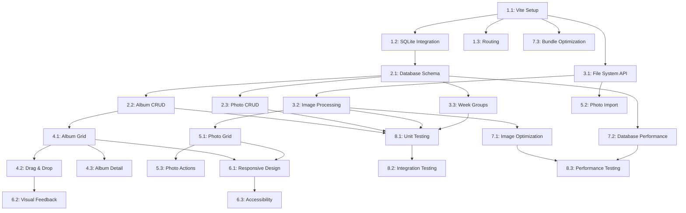

# Development Tasks: Photo Album Organizer

## Task Overview

**Total Tasks**: 24 tasks across 8 phases
**Estimated Duration**: 3-4 weeks
**Priority**: High (Core functionality) → Medium (Enhancement) → Low (Polish)

## Phase 1: Project Setup & Core Infrastructure

### Task 1.1: Initialize Vite Project
**Priority**: High | **Estimated Time**: 2 hours | **Dependencies**: None
- [x] Create new Vite project with vanilla JavaScript template
- [x] Configure package.json with minimal dependencies
- [x] Set up development and build scripts
- [x] Configure Vite for optimal development experience
- [x] Create basic project structure (src/, public/, etc.)

**Acceptance Criteria**:
- Vite dev server runs without errors
- Basic HTML file loads in browser
- Build process creates optimized bundle

### Task 1.2: SQLite Database Integration
**Priority**: High | **Estimated Time**: 4 hours | **Dependencies**: Task 1.1
- [x] Install and configure sql.js library
- [x] Create database service wrapper
- [x] Implement database initialization
- [x] Add error handling for database operations
- [x] Create database connection management

**Acceptance Criteria**:
- SQLite database initializes successfully
- Basic CRUD operations work
- Database persists across browser sessions
- Error handling covers connection failures

### Task 1.3: Basic Routing System
**Priority**: High | **Estimated Time**: 3 hours | **Dependencies**: Task 1.1
- [x] Implement History API routing
- [x] Create route definitions for main views
- [x] Add navigation between album list and album detail
- [x] Implement route parameter handling
- [x] Add browser back/forward support

**Acceptance Criteria**:
- URL changes reflect current view
- Navigation works with browser buttons
- Route parameters are properly parsed
- 404 handling for invalid routes

## Phase 2: Database Schema & Operations

### Task 2.1: Database Schema Creation
**Priority**: High | **Estimated Time**: 3 hours | **Dependencies**: Task 1.2
- [x] Create albums table with proper schema
- [x] Create photos table with foreign key constraints
- [x] Add database indexes for performance
- [x] Implement schema migration system
- [x] Add database validation rules

**Acceptance Criteria**:
- Tables created with correct structure
- Foreign key constraints enforced
- Indexes improve query performance
- Schema can be migrated/updated

### Task 2.2: Album CRUD Operations
**Priority**: High | **Estimated Time**: 4 hours | **Dependencies**: Task 2.1
- [x] Implement create album functionality
- [x] Add read/query album operations
- [x] Create update album functionality
- [x] Implement delete album with cascade
- [x] Add album validation and error handling

**Acceptance Criteria**:
- All album operations work correctly
- Validation prevents invalid data
- Cascade delete removes associated photos
- Error messages are user-friendly

### Task 2.3: Photo CRUD Operations
**Priority**: High | **Estimated Time**: 4 hours | **Dependencies**: Task 2.1
- [x] Implement add photo to album
- [x] Add query photos by album
- [x] Create remove photo functionality
- [x] Add photo metadata validation
- [x] Implement photo file path management

**Acceptance Criteria**:
- Photos can be added/removed from albums
- Metadata is properly validated
- File paths are correctly managed
- Operations handle errors gracefully

## Phase 3: File System Integration

### Task 3.1: File System Access API
**Priority**: High | **Estimated Time**: 5 hours | **Dependencies**: Task 1.1
- [x] Implement File System Access API integration
- [x] Add file input fallback for older browsers
- [x] Create file selection and reading functionality
- [x] Add file validation (image formats, size limits)
- [x] Implement file path management

**Acceptance Criteria**:
- Users can select photos from file system
- Fallback works in browsers without File System Access API
- Only valid image files are accepted
- File paths are properly managed

### Task 3.2: Image Processing & Thumbnails
**Priority**: High | **Estimated Time**: 6 hours | **Dependencies**: Task 3.1
- [x] Implement Canvas API thumbnail generation
- [x] Add image format detection and validation
- [x] Create thumbnail caching system
- [x] Implement lazy loading for images
- [x] Add image optimization for performance

**Acceptance Criteria**:
- Thumbnails generate correctly for all supported formats
- Caching improves performance
- Lazy loading reduces initial load time
- Images display properly in tile layout

### Task 3.3: Week Group Generation
**Priority**: Medium | **Estimated Time**: 2 hours | **Dependencies**: Task 2.1
- [x] Implement ISO week format generation
- [x] Add date parsing and validation
- [x] Create week group utilities
- [x] Add timezone handling
- [x] Implement week group sorting

**Acceptance Criteria**:
- Week groups follow ISO format (YYYY-W##)
- Date parsing handles various formats
- Sorting works correctly across years
- Timezone issues are handled properly

## Phase 4: Album Management UI

### Task 4.1: Album Grid Component
**Priority**: High | **Estimated Time**: 5 hours | **Dependencies**: Task 2.2
- [x] Create album grid layout with CSS Grid
- [x] Implement album card display
- [x] Add album creation interface
- [x] Create album deletion confirmation
- [x] Add responsive design for mobile

**Acceptance Criteria**:
- Albums display in organized grid
- Creation/deletion interfaces work
- Layout is responsive
- Visual feedback is clear

### Task 4.2: Drag and Drop Implementation
**Priority**: High | **Estimated Time**: 6 hours | **Dependencies**: Task 4.1
- [x] Implement HTML5 drag and drop API
- [x] Add visual feedback during drag operations
- [x] Create drop zone indicators
- [x] Implement album reordering logic
- [x] Add touch support for mobile devices

**Acceptance Criteria**:
- Drag and drop works smoothly
- Visual feedback is clear
- Reordering persists in database
- Touch devices are supported

### Task 4.3: Album Detail View
**Priority**: High | **Estimated Time**: 4 hours | **Dependencies**: Task 4.1
- [x] Create album detail page layout
- [x] Implement photo grid display
- [x] Add album information display
- [x] Create navigation back to album list
- [x] Add album editing capabilities

**Acceptance Criteria**:
- Album details display correctly
- Photo grid shows all photos
- Navigation works properly
- Editing interface is intuitive

## Phase 5: Photo Management UI

### Task 5.1: Photo Grid Component
**Priority**: High | **Estimated Time**: 4 hours | **Dependencies**: Task 3.2
- [x] Create responsive photo tile layout
- [x] Implement photo thumbnail display
- [x] Add photo selection functionality
- [x] Create photo removal interface
- [x] Add loading states and error handling

**Acceptance Criteria**:
- Photos display in organized grid
- Thumbnails load efficiently
- Selection and removal work
- Loading states provide feedback

### Task 5.2: Photo Import Interface
**Priority**: High | **Estimated Time**: 3 hours | **Dependencies**: Task 3.1
- [x] Create photo import button/interface
- [x] Implement batch photo selection
- [x] Add import progress indicators
- [x] Create import error handling
- [x] Add import success feedback

**Acceptance Criteria**:
- Users can select multiple photos
- Progress is clearly indicated
- Errors are handled gracefully
- Success feedback is provided

### Task 5.3: Photo Management Actions
**Priority**: Medium | **Estimated Time**: 3 hours | **Dependencies**: Task 5.1
- [x] Implement photo removal from albums
- [x] Add photo move between albums
- [x] Create photo metadata display
- [x] Add photo context menu
- [x] Implement bulk photo operations

**Acceptance Criteria**:
- Photo operations work correctly
- Context menu is intuitive
- Bulk operations are efficient
- Metadata display is helpful

## Phase 6: User Experience & Polish

### Task 6.1: Responsive Design
**Priority**: Medium | **Estimated Time**: 4 hours | **Dependencies**: Task 4.1, 5.1
- [x] Optimize layout for mobile devices
- [x] Implement touch-friendly interactions
- [x] Add responsive breakpoints
- [x] Test across different screen sizes
- [x] Optimize for tablet devices

**Acceptance Criteria**:
- Layout works on all screen sizes
- Touch interactions are smooth
- Breakpoints are well-defined
- Performance is maintained

### Task 6.2: Visual Feedback & Animations
**Priority**: Medium | **Estimated Time**: 3 hours | **Dependencies**: Task 4.2
- [x] Add loading animations
- [x] Implement hover effects
- [x] Create transition animations
- [x] Add success/error notifications
- [x] Implement smooth scrolling

**Acceptance Criteria**:
- Animations enhance user experience
- Feedback is clear and timely
- Performance is not impacted
- Animations work across browsers

### Task 6.3: Accessibility Implementation
**Priority**: Medium | **Estimated Time**: 4 hours | **Dependencies**: All UI tasks
- [x] Add proper ARIA labels
- [x] Implement keyboard navigation
- [x] Add screen reader support
- [x] Ensure color contrast compliance
- [x] Test with accessibility tools

**Acceptance Criteria**:
- WCAG 2.1 AA compliance
- Keyboard navigation works
- Screen readers can access content
- Color contrast meets standards

## Phase 7: Performance & Optimization

### Task 7.1: Image Optimization
**Priority**: Medium | **Estimated Time**: 3 hours | **Dependencies**: Task 3.2
- [x] Implement image lazy loading
- [x] Add intersection observer for performance
- [x] Optimize thumbnail generation
- [x] Implement image caching strategy
- [x] Add progressive image loading

**Acceptance Criteria**:
- Images load efficiently
- Lazy loading improves performance
- Caching reduces repeated operations
- Progressive loading enhances UX

### Task 7.2: Database Performance
**Priority**: Medium | **Estimated Time**: 2 hours | **Dependencies**: Task 2.1
- [x] Optimize database queries
- [x] Add query result caching
- [x] Implement connection pooling
- [x] Add database performance monitoring
- [x] Optimize for large datasets

**Acceptance Criteria**:
- Queries execute quickly
- Caching improves performance
- Large datasets are handled efficiently
- Performance monitoring is in place

### Task 7.3: Bundle Optimization
**Priority**: Low | **Estimated Time**: 2 hours | **Dependencies**: Task 1.1
- [x] Optimize Vite build configuration
- [x] Implement code splitting
- [x] Add tree shaking for unused code
- [x] Optimize asset loading
- [x] Minimize bundle size

**Acceptance Criteria**:
- Bundle size is minimized
- Code splitting works correctly
- Assets load efficiently
- Build process is optimized

## Phase 8: Testing & Quality Assurance

### Task 8.1: Unit Testing
**Priority**: High | **Estimated Time**: 6 hours | **Dependencies**: All core tasks
- [x] Set up testing framework (Jest/Vitest)
- [x] Write tests for database operations
- [x] Add tests for utility functions
- [x] Test image processing functions
- [x] Achieve 80% code coverage

**Acceptance Criteria**:
- All business logic is tested
- Code coverage meets requirements
- Tests are maintainable
- CI/CD integration works

### Task 8.2: Integration Testing
**Priority**: High | **Estimated Time**: 4 hours | **Dependencies**: Task 8.1
- [ ] Test complete user workflows
- [ ] Add end-to-end test scenarios
- [ ] Test file system integration
- [ ] Verify database operations
- [ ] Test cross-browser compatibility

**Acceptance Criteria**:
- All user flows work correctly
- Integration points are tested
- Cross-browser compatibility verified
- Edge cases are covered

### Task 8.3: Performance Testing
**Priority**: Medium | **Estimated Time**: 3 hours | **Dependencies**: Task 7.1, 7.2
- [ ] Test with large photo collections
- [ ] Measure load times and performance
- [ ] Test memory usage patterns
- [ ] Verify performance targets
- [ ] Add performance monitoring

**Acceptance Criteria**:
- Performance targets are met
- Large datasets are handled
- Memory usage is optimized
- Monitoring is in place

## Task Dependencies

## Parallel Execution Opportunities

**Phase 1-2**: Can be done in parallel after Task 1.1
**Phase 3**: Can start after Task 1.1 completes
**Phase 4-5**: Can be done in parallel after Phase 2-3
**Phase 6**: Can start after Phase 4-5
**Phase 7**: Can be done in parallel with Phase 6
**Phase 8**: Requires all previous phases

## Risk Mitigation

### High-Risk Tasks
- **Task 3.1**: File System Access API browser compatibility
- **Task 4.2**: Drag and drop cross-browser support
- **Task 3.2**: Image processing performance with large files

### Mitigation Strategies
- Implement fallbacks for unsupported browsers
- Test across multiple browsers early
- Optimize image processing algorithms
- Add performance monitoring and limits
